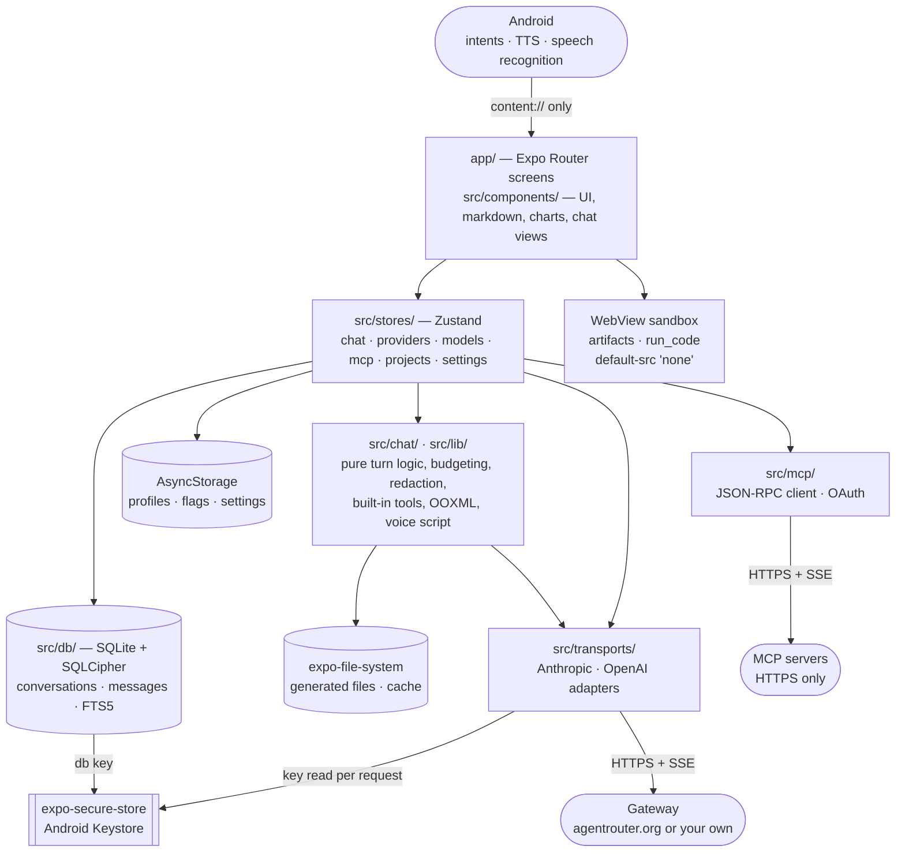
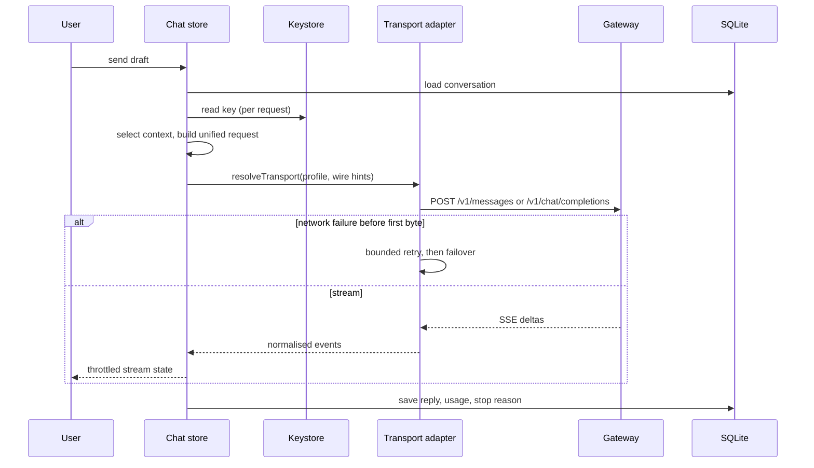
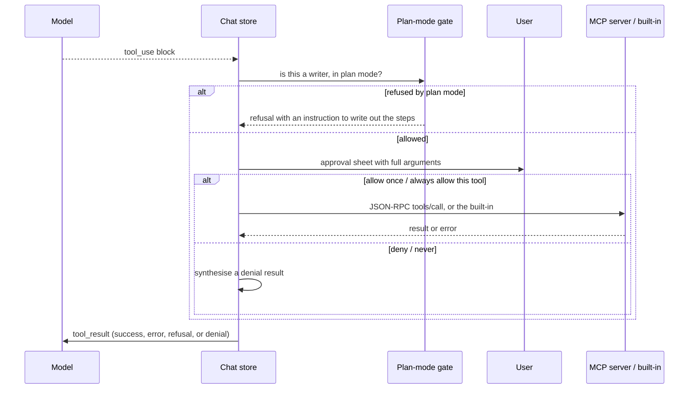
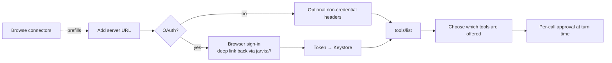

# SuperAgent

An offline-first Android chat client for Anthropic- or OpenAI-compatible gateway. Conversations, model settings,
usage data and diagnostics stay on the device. The API key is stored only in the
Android Keystore, and the transcript database is encrypted at rest.

Built with Expo SDK 57 and React Native 0.86. Ships as a direct APK — no Play Store
listing, no telemetry. JavaScript-only fixes reach a device over an EAS Update channel;
anything native is a new APK.

[](https://github.com/Suke2004/SuperAgent/actions/workflows/ci.yml)
[](LICENSE)

> The display name, the export header, the backup envelope and the MCP client
> registration all read **SuperAgent** from one constant
> ([src/lib/app.ts](src/lib/app.ts)). The package slug (`agentrouter-mobile`), the
> Android package (`org.lyric.agentrouter`) and the URL scheme (`jarvis://`) keep their
> original values on purpose: they are identity, not presentation, and changing them
> would orphan every install and every OAuth redirect already registered.

---

## What it does

Point it at a gateway, paste a token, and talk to a model. Everything past that is
about making a phone a serious place to do that:

- The two AgentRouter wire formats are separate adapters behind one streaming
  interface, so message shape, image encoding, streaming events, tool schemas and
  stop reasons are handled per-dialect instead of approximated.
- Conversations are SQLite rows with FTS5 search, not a JSON blob.
- Context pressure is measured, not guessed: per-message exclusion, rolling
  summarisation, and a token budget that does not double-count thinking against the
  output allowance.
- Tools arrive from MCP servers you add yourself — from a bundled directory of eleven
  common ones, or by URL — plus a small set of built-ins that
  produce real files — Markdown, CSV, JSON, PDF, `.docx`, `.xlsx`, `.pptx` — and every
  call is approved by you mid-turn with its full arguments on screen.
- Reading a document does not need a server: PDFs, text and Word, Excel and PowerPoint
  files are parsed on the device, and a file can be handed in from another app.
- A turn that fails on a dead network is queued and retried when the gateway is
  reachable again, rather than lost.
- Anything that renders untrusted content — an artifact preview, a code sandbox — runs
  in a WebView with no network, no storage and no bridge back into the app.

## Key features

| | |
| --- | --- |
| **Chat** | Streaming replies revealed as they are written, abort and retry, partial replies kept and marked when a stream dies |
| **Providers** | Multiple profiles, custom origins, per-profile extra headers, a staged Test-connection flow that reports the gateway's own error text |
| **Models** | Runtime discovery plus hand-editable capability flags, context limits and pricing; hand edits survive later discovery |
| **Reasoning** | Thinking budgets, sampling parameters, stop sequences |
| **Rendering** | Markdown with syntax-highlighted code, tables, LaTeX, Mermaid diagrams, bar/line/scatter charts from a ` ```chart ` fence, ANSI terminal output, and a scheme-allowlist link sanitiser |
| **Attachments** | An in-app camera with multi-shot review, photo library, documents, Word/Excel/PowerPoint read on device, files opened from another app, and `@file` mentions — twenty per conversation |
| **Artifacts** | Preview any `html` or `svg` fence in a sandboxed WebView beside the conversation |
| **Built-in tools** | `write_file`, `create_pdf`, `create_document` (docx/xlsx/pptx), `fetch_url`, `read_mcp_resource`, `run_code`, provider-side web search — with one line in the conversation menu saying which of them this turn actually has |
| **Files** | A generated file is previewed, edited and saved back in the app, or copied out to a folder of your choosing |
| **Voice** | Hold-to-talk dictation into the draft, read aloud, and a full-screen voice mode with five voices and four speeds |
| **Commands** | `/` over prompt templates, skills, MCP prompts and app commands; `@` over files, skills and servers |
| **Projects** | Grouped conversations with shared instructions and reference documents |
| **Plan mode** | A per-conversation gate in the tool router: reads allowed, writers and MCP refused |
| **Context** | Pressure indicators, per-message exclusion, rolling summarisation |
| **Skills** | Markdown skills with YAML frontmatter, single-file or `.zip` import/export, per-conversation toggles |
| **MCP** | JSON-RPC over HTTP/SSE, OAuth hand-off, per-tool approval, prompts and resources, and a bundled directory of eleven servers so connecting to a common one does not need its URL |
| **Memory** | Distilled durable facts, confirmed one at a time, with a per-conversation opt-out |
| **Search** | FTS5 across conversations and messages |
| **Offline** | Reachability tracking and a retry queue |
| **Usage** | Tokens and cost by day and model, from gateway-reported numbers only |
| **Export** | Markdown and JSON, redacted twice, never carrying attachment bytes |
| **Privacy** | Optional app lock behind the device biometric or PIN |
| **A11y** | Screen-reader labels, disabled-state explanations, an announcement when a reply lands (its length, not its text), read aloud, full font scaling, and Reduce Motion honoured as a distinction rather than a switch |
| **Updates** | A JavaScript fix arrives over the update channel; while one is waiting, Settings offers to restart and finish it instead of waiting for a cold start |

## Architecture overview

Full detail in [ARCHITECTURE.md](ARCHITECTURE.md). The short version:



Layer rules, which are the load-bearing part:

| Layer | What lives there |
| --- | --- |
| `app/` | Expo Router screens. Deliberately thin — `jest.config.js` matches `*.test.ts` only, so logic in a component is logic no test can reach. |
| `src/components/` | UI primitives, the markdown/highlighting renderer, chart drawing, chat views, the motion vocabulary. |
| `src/chat/` | Pure turn logic: request building and validation, trimming, budgeting, attachments, the camera's arithmetic, built-in tools, Office reading and writing, skills, prompts, export, backup, speech, voice scripting, inbound intents. |
| `src/constants/` | The animation vocabulary — every duration, curve and spring the app may use. |
| `src/stores/` | Zustand state persisted to AsyncStorage. Never the key. |
| `src/db/` | SQLite. All DDL is plain SQL in `ddl.ts` with no `expo-sqlite` import, so tests build the real schema under `node:sqlite`. |
| `src/transports/` | Anthropic and OpenAI adapters behind one streaming interface. `fetch` is injected, which is what lets the layer be tested in plain Node. |
| `src/mcp/` | Hand-rolled JSON-RPC client, protocol parsing, OAuth hand-off, and `catalog.ts` — the connector directory, which is bundled data rather than a registry client. |
| `src/lib/` | Token estimation, redaction, secure key access, app lock, logging. |

### Request lifecycle



### Tool execution and approval



Every outcome — success, server error, timeout, denial, plan-mode refusal — returns as a
tool *result*, so a refused call never costs the conversation. The plan-mode gate lives
in the router rather than in the system prompt, so a tool added later inherits it.

## Screenshots

None are committed yet. `mockups/` holds the HTML design concepts the UI was built
from; open any of them in a browser. Device screenshots will land here when V1 is
published.

## Tech stack

| | |
| --- | --- |
| Runtime | React Native 0.86.3, React 19.2.3 (React Compiler on), Expo SDK 57 (managed workflow) |
| Navigation | `expo-router` 57 with typed routes |
| State | Zustand 5, persisted to `@react-native-async-storage/async-storage` |
| Database | `expo-sqlite` 57 with SQLCipher, FTS5, WAL |
| Secrets | `expo-secure-store` (Android Keystore), `expo-local-authentication` |
| Lists | `@shopify/flash-list` 2 |
| Markdown | `marked` 18 + `refractor` 5 |
| Motion | `react-native-reanimated` 4.5.1, `react-native-gesture-handler` 2.32, `react-native-worklets`, `expo-haptics`, `expo-blur`, `expo-linear-gradient` |
| Icons | `@expo/vector-icons` 15 (Feather only, behind a role map) |
| Sandboxing | `react-native-webview` 13 for artifacts and `run_code`, under `default-src 'none'` |
| Files | `fflate` (skill zips, Office read **and** write), `js-yaml` (frontmatter), `expo-file-system`, `expo-document-picker`, `expo-print`, `expo-sharing` |
| Speech | `expo-speech` (read aloud, voice mode output), `expo-speech-recognition` (dictation, voice mode input) |
| Images | `expo-camera` 57 (the in-app viewfinder), `expo-image-picker` (gallery), `expo-image-manipulator` (the resize-and-recompress ladder) |
| OTA | `expo-updates` 57, `preview` and `production` channels |
| Language | TypeScript 6, `strict` + `noUncheckedIndexedAccess` + `noFallthroughCasesInSwitch` |
| Tests | Jest 29 in the `node` environment; `node:sqlite` for real-schema database tests |
| Lint | ESLint 10 with `eslint-config-expo` (flat config) |
| Build | EAS Build, APK, internal distribution |

Deliberately **not** dependencies, each because something already in the tree covers it:
no chart library and no `react-native-svg` (charts are views and text), no OOXML writer
(`fflate` plus hand-written XML), no audio library, and no barcode scanner (`expo-camera`
is installed with `barcodeScannerEnabled: false`, which drops the ML Kit dependency).

## Requirements

| | |
| --- | --- |
| Node | **24 or newer** — the database tests import `node:sqlite`, which needs `--experimental-sqlite` on Node 22 |
| pnpm | 10.29.1 (the version CI pins and the lockfile was written by) |
| Android | A physical device or emulator. The dev client and release APK are Android-only; iOS is not a target. |
| EAS | An [Expo account](https://expo.dev) — only needed to build an APK, not to run the app |
| Java / Android SDK | Only for `pnpm android` or `eas build --local`. A cloud EAS build needs neither. |

## Installation

```bash
git clone https://github.com/Suke2004/SuperAgent.git
cd SuperAgent
pnpm install
```

pnpm only. `pnpm-lock.yaml` is the committed lockfile; `package-lock.json` and
`yarn.lock` are gitignored, and CI installs with `--frozen-lockfile`.

## Environment configuration

**There is no `.env`, and the app reads no environment variables.** That is
deliberate rather than missing: a gateway token in a dotfile is a token in a
plaintext file that gets committed eventually. Keys are pasted into
Settings → Providers at runtime and stored in the Android Keystore via
`expo-secure-store`.

The one credential anywhere near this project lives in GitHub, not on disk:

| Secret | Where | Why |
| --- | --- | --- |
| `EXPO_TOKEN` | GitHub → Settings → Secrets and variables → Actions | Lets `build-apk.yml` submit an EAS build. An Expo account token, not a signing key — the Android keystore stays in EAS. |

No gateway key ever enters CI, because CI has no reason to talk to a gateway. Keep
that true.

## Development setup

```bash
pnpm install
pnpm start          # Metro; press `a` for Android, or scan with the dev client
```

`expo-sqlite` with SQLCipher, `expo-speech`, `expo-speech-recognition`,
`expo-local-authentication`, `expo-secure-store`, `react-native-webview`,
`react-native-gesture-handler`, `expo-blur` and `@expo/vector-icons` are native modules.
Expo Go cannot load them — use a **development build**:

```bash
pnpm android                                  # local build + install, needs the Android SDK
# or
eas build --platform android --profile development
```

Install that once, then `pnpm start` connects to it for JS changes. A rebuild is
needed only when native config changes.

## Running the application

| Command | What it does |
| --- | --- |
| `pnpm start` | Metro dev server for the dev client |
| `pnpm android` | Local debug build, installs on the connected device |
| `pnpm web` | `react-native-web` preview. **Development only** — no Keystore, so keys live in a page variable for the session and the app says so on screen. |

First run: Settings → Providers. AgentRouter is the default — pick Anthropic or
OpenAI, paste the token, save. For another gateway choose Custom URL and enter its
origin. The two AgentRouter endpoints are **not** interchangeable:

- Anthropic: `https://agentrouter.org` (**no** `/v1`) → `POST /v1/messages`
- OpenAI: `https://agentrouter.org/v1` → `POST /v1/chat/completions`, `GET /v1/models`

The selected transport normalises `/v1` itself. Day-to-day operation is
[docs/USAGE.md](docs/USAGE.md).

## Building the APK

```bash
pnpm run build:preview
```

```bash
pnpm run build:preview:local
```

The first is an EAS cloud build on the `preview` profile; the second is the same
profile built on this machine. `pnpm run build:dev` and `pnpm run build:production`
cover the other two profiles.

Profiles are in `eas.json`: `development` (dev client), `preview` (release candidate
APK, channel `preview`), `production` (channel `production`, `autoIncrement: true`).
All three produce an APK with internal distribution — there is no AAB and no store
submission.

Or from GitHub: **Actions → Build APK → Run workflow**, choosing `preview` or
`production`. Pushing a `v*` tag triggers the same workflow at `preview`. Both paths
re-run all the gates first, because a tag can point at a commit that never saw CI.

## Production build and release

Full process, checklists and rollback paths: [docs/07_Deployment.md](docs/07_Deployment.md).
The outline:

1. Everything green locally — `pnpm gates` plus the Android bundle.
2. Bump `expo.version` **and** `expo.android.versionCode` in `app.json`, or run
   `pnpm run release:patch|minor|major`, which does both. A `versionCode` may never
   repeat or go backwards.
3. Update [CHANGELOG.md](CHANGELOG.md).
4. Commit, tag `vX.Y.Z`, push the tag — `build-apk.yml` re-runs the gates and submits
   an EAS build.
5. Download the APK from the Expo dashboard, install it on a physical device, and run
   the device protocol in [docs/07_Deployment.md](docs/07_Deployment.md) §7.
6. Attach the APK to a GitHub release.

**OTA updates are enabled** (`updates.enabled: true`, `runtimeVersion` policy
`appVersion`). A JavaScript-only fix can be published to a channel with
`pnpm run update:preview` or `pnpm run update:production`, and rolled back with
`pnpm run update:rollback`. That does **not** replace the device pass in step 5: an
update is only loadable by an APK whose `runtimeVersion` matches, so anything that
touches a native module still needs a build, and the CHANGELOG marks those entries
**needs a rebuild**.

## MCP setup

Settings → **MCP servers** → **Browse connectors**, or **Add by URL**.

The directory holds eleven servers people commonly use — DeepWiki, Context7, Cloudflare
docs, Hugging Face, Stripe, GitHub, Sentry, Notion, Linear, Jira and Confluence, Asana —
ordered so the ones needing no account come first. It is a **snapshot**, dated on screen
from `CATALOG_AS_OF` in `src/mcp/catalog.ts`, of addresses those vendors control: tapping
an entry prefills the same add form as any other server and saves nothing, so you confirm
the URL yourself. If a connector stops working the entry has gone stale, and each one
carries the vendor's own documentation link for looking up the current endpoint. Nothing
in the list is vetted or recommended by this project.

**`http(s)` only.** A phone cannot spawn the local processes stdio transports need, so
that field does not exist rather than existing and never working. If a server you want
is stdio-only, put it behind an HTTP bridge on a machine you control.



### Adding and configuring a server

1. Paste the server URL, or pick one from the directory to have it filled in for you.
   `https` is required; a plaintext origin is refused. The directory shortcut runs the
   same validation as a typed URL — it is a shortcut into the form, not around it.
2. Sign in if it uses OAuth. Tokens go into the Keystore beside the API key, so they
   are redacted from logs and exports from the moment they exist. The `state` nonce is
   full-length and matched on the deep-link callback.
3. Pick which of the server's tools are offered to the model. Nothing is offered by
   default.
4. During a turn, each call is approved individually — *allow once*, *always allow this
   tool*, *deny*, *never* — with the full arguments shown. Leaving the screen resolves
   nothing; the question is still there when you come back.

**Credential headers are refused in the server form.** `authorization`,
`proxy-authorization` and `x-api-key` are rejected rather than stored in AsyncStorage,
and because restoring a backup goes through the same validation, a hand-edited backup
gets the same refusal the form does.

### The trust boundary

An MCP server is code you chose to trust, and a tool result is untrusted input that
reaches the model. Two things follow, both worth stating because neither is enforceable
from inside the app:

- A tool you always-allow runs without asking again. `always` is a decision about the
  server, not the call.
- A malicious server can put instructions in a tool result. The app never runs model
  output in its own engine — no `eval`, no shell, and the one place model-written code
  does run (`run_code`, off by default) is a WebView with no network, no storage and no
  bridge into the app. But the model reads every result. Add servers the way you would
  install a package.

## Security considerations

Reporting: [SECURITY.md](SECURITY.md). Every finding this project has had, fixed or
open, with its reasoning: [docs/flaws.md](docs/flaws.md).

Three storage tiers, one rule each:

| Tier | Holds | Rule |
| --- | --- | --- |
| Android Keystore | API keys, MCP OAuth tokens, the database key | Never leaves. Not in Zustand, AsyncStorage, logs, exports, backups or git. |
| SQLite | Conversations, messages, memories, MCP rows | AES-256 at rest (SQLCipher) under a Keystore key. Not backup-eligible. |
| AsyncStorage | Provider metadata, model flags, settings | Plaintext on disk — nothing secret may enter a `partialize` output. |

- **The key is read per request** and cached in memory only. Both that cache and the
  transports holding it are dropped when the app is backgrounded; the redactor is
  re-primed from the Keystore on the way back.
- **The database is encrypted** — SQLCipher, AES-256, 32-byte CSPRNG key in one
  Keystore slot. An existing plaintext file is converted once on first launch through a
  two-move swap, so a process killed mid-conversion always leaves one intact copy.
  There is **no escrow**: clearing app data destroys the key and the conversations.
- **`Authorization`, `x-api-key` and `User-Agent` are enforced**, not defaulted — a
  profile header colliding with any of them is deleted before the real one is set, in
  both the HTTP client and the MCP client.
- **Android auto-backup is off** (`allowBackup: false` plus `dataExtractionRules`, via
  `plugins/with-no-backup.js`), so the transcript is not eligible for Google Drive or
  `adb backup`.
- **HTTPS only, system CAs only** — `plugins/with-system-ca-only.js` refuses
  user-installed CAs, which is what certificate pinning was wanted for and costs
  nothing when an operator rotates. Cleartext traffic is refused by the platform in a
  release build and permitted only in the debug source set, where Metro needs it.
- **OTA updates are enabled** (`updates.enabled: true`, `checkAutomatically: ON_LOAD`,
  channels `preview` and `production`, `runtimeVersion` policy `appVersion`). This is
  remote-code trust, deliberately taken: it is the only way a JavaScript fix reaches a
  device that installed an APK directly. The channel is signed by Expo and scoped to a
  runtime version, so an update cannot cross a native boundary, and
  `fallbackToCacheTimeout: 0` means a slow network never delays a cold start.
- **Untrusted content is kept out of privileged paths.** A model reply, a skill file, an
  MCP tool result, a restored backup and a file handed in by another app are all
  untrusted. An inbound "open with" intent accepts only a `content://` URI from the
  system provider — a `file://` path is refused, because `file:///data/data/…` can name
  this app's own private storage, including the encrypted database.
- **The two WebViews are sealed.** Artifact previews and `run_code` load under
  `default-src 'none'` with only inline style and script allowed; navigation away from
  the first document is refused and reported, and `run_code` is given up on after five
  seconds. Both are off or opt-in, and neither can reach the Keystore, the database or
  the network.
- **Redaction at the write boundary.** The debug log and both export formats are
  redacted; exports redact twice and a test greps the finished artefact rather than
  asserting a call site. Exports never carry attachment bytes; backups never carry
  keys, tokens, conversations or memories.
- **Optional app lock** behind the device biometric or PIN, off by default. Separate
  from encryption on purpose: the database key is *not* auth-gated, because that would
  deny the offline send queue access while the device is locked.
- **No telemetry, no analytics, no crash reporting, no `eval`.**
- **The User-Agent is honest and static** (`AgentRouterMobile/1.0 (Android)`).
  Impersonating another client to get past a gateway allowlist is not done here.
- **`pnpm audit` reports three advisories**, all in build tooling that never ships to
  the device (`image-size` via Metro, `uuid` via `xcode`). Not overridden, and why:
  [docs/flaws.md](docs/flaws.md) §5.

## Project structure

```text
app/                      Expo Router screens
  _layout.tsx             Root layout, app lock, background key eviction, toasts
  +native-intent.tsx      Inbound "open with" intents → /new, before any React tree
  index.tsx               Conversation list
  new.tsx                 New-conversation entry, carries a handed-in file
  chat/[id].tsx           The chat screen
  settings/               Providers, models, MCP, built-in tools, skills, prompts,
                          memory, projects, usage, appearance, backup, debug
src/
  chat/                   Pure turn logic — request, trim, budget, attachments,
                          camera session, built-in tools, OOXML read/write,
                          artifacts, sandbox, skills, prompts, projects, export,
                          backup, summary, speech, voice script, terminal,
                          inbound intents
  components/             UI primitives, chat views, markdown renderer, charts,
                          motion vocabulary, icon role map, context menu, toasts
  constants/              animations.ts — every duration, curve and spring
  db/                     SQLite: ddl, schema/migrations, queries, cipher, FTS
  lib/                    secureKey, redact, appLock, dictation, tokens, log,
                          storage, app name
  mcp/                    JSON-RPC client, protocol, OAuth, connector directory
  stores/                 Zustand: chat, providers, models, mcp, skills,
                          prompts, projects, memory, settings, queue, reachability
  theme/                  Tokens, the series palette, and the theme provider
  transports/             Anthropic + OpenAI adapters, SSE, retry, headers
plugins/                  Config plugins: no-backup, system-CA-only
scripts/                  gen-icons.mjs, bump-version.mjs
docs/                     PRD, TRD, data model, eng plan, deployment,
                          guidelines, usage, flaws, UX test reports
mockups/                  HTML design concepts the UI was built from
.github/workflows/        ci.yml, build-apk.yml
```

Tests sit next to what they test (`src/chat/budget.test.ts`) or in a
`__tests__/` directory where a module needs fixtures.

## Testing

```bash
pnpm gates            # typecheck + lint + tests with coverage floors
pnpm typecheck
pnpm lint
pnpm test
pnpm test:watch
pnpm test:coverage
```

The fourth gate, which CI also runs and the other three structurally cannot replace:

```bash
pnpm expo export --platform android --output-dir .expo-export
```

A full Metro bundle, output discarded, exit code only. `tsc` resolves types but not
what Metro resolves — a bad `@/` alias, a missing asset or a web-only module passes
typecheck and fails on the device.

**1,603 tests in 80 suites, ~5s.** Jest runs in the `node` environment, not
`jest-expo`: transports take an injected `fetch`, and `src/db/ddl.ts` is plain SQL
strings with no `expo-sqlite` import, so the database tests build the real schema under
`node:sqlite` and assert query plans with `EXPLAIN QUERY PLAN`.

`testMatch` is `*.test.ts` — never `.tsx`. Components are untested **by design**, and
the consequence is stated rather than hidden: `app/chat/[id].tsx` is the largest, most
stateful file in the app and has zero unit coverage. Rendering, gestures, navigation and
layout are caught by the device protocol in
[docs/07_Deployment.md](docs/07_Deployment.md) §7 or not at all. The reasoning and the
conditions for revisiting it are in [docs/06_Eng_Plan.md](docs/06_Eng_Plan.md) §7.1.

The `node` environment is also a design constraint, not just a setting: there is no
setup file and no `react-native` in the module graph, so a module that wants a test may
not import one. That is why `src/chat/files.ts` reaches
`expo-file-system/legacy` through a dynamic `import()` and why `attach.ts` branches on
whether a picker is *available* rather than on `Platform.OS`. It is the same rule that
produces the pure-module-plus-view pairs throughout `src/chat/`
(`voice.ts`/`VoiceMode.tsx`, `camera.ts`/`CameraMode.tsx`, `chart.ts`/`ChartView.tsx`,
`preview.ts`/`FilePreview.tsx`, `toolLabel.ts`/`ContentBlocks.tsx`,
`incoming.ts`/`+native-intent.tsx`, `list.ts`/`Sidebar.tsx`).

Coverage at the last full run: **70.05% statements, 66.24% branches, 64.49% functions,
71.62% lines**, against floors of 66 / 63 / 58 / 68.

`coverageThreshold` in `jest.config.js` is a **floor at the measured rate**, not a
target. Raise it when a run comes in comfortably higher; never lower it to make a red
run green.

The three cost guards in `src/chat/list-cost.test.ts` assert a **ratio, never a
duration** — a quarter of the input against all of it, with the larger run required to
cost under 12× the smaller (linear is 4, quadratic is 16). They used to assert wall-clock
budgets and two of them failed as soon as a second Jest process shared the CPU, with the
code untouched. Do not convert one back to a clock reading, and do not add a fourth guard
that is one: both halves of a ratio meet the same load, so load cancels out.

## Continuous integration

Two workflows, both on `ubuntu-latest` with Node 24 and pnpm 10.29.1:

| Workflow | Trigger | Does |
| --- | --- | --- |
| [`ci.yml`](.github/workflows/ci.yml) | Every push to `main`, every pull request | `pnpm install --frozen-lockfile`, typecheck, lint, tests with coverage, Android bundle, coverage table in the run summary |
| [`build-apk.yml`](.github/workflows/build-apk.yml) | Manual dispatch, or a `v*` tag | Re-runs all gates, then submits an EAS build with `--no-wait` |

One job rather than three: install costs more than all the gates together, so splitting
them to get parallel red X's would triple it for a few seconds of wall clock. In-flight
CI runs are cancelled on force-push; build runs are not, because a cancelled build can
leave a queued EAS job with nothing watching it.

[`dependabot.yml`](.github/dependabot.yml) watches non-Expo dependencies and the Actions
monthly. Expo-owned packages are ignored on purpose — the SDK pins them as a tested set,
so they move together during an SDK upgrade via `npx expo install --fix`, never
individually.

## Troubleshooting

| Symptom | Cause and fix |
| --- | --- |
| `401 unauthorized_client_error` from the gateway | Server-side gating that fires **before** the credential is read — a request with no key at all returns the same body. Not necessarily your key. See [docs/flaws.md](docs/flaws.md) §1 and §1b for how to tell the two apart with a real token. |
| Database tests fail to load with an error about `node:sqlite` | Node 22 or older. Use Node 24. |
| `ERR_PNPM_OUTDATED_LOCKFILE` in CI | `package.json` changed without the lockfile. Run `pnpm install` and commit `pnpm-lock.yaml`. |
| Read aloud, the app lock, dictation, icons or artifact previews are missing on a device | All native modules. An APK built before they were added needs a rebuild — an OTA update cannot cross a `runtimeVersion` boundary. |
| Voice mode listens but never speaks | The device has no text-to-speech voice installed for the locale. Android Settings → Accessibility → Text-to-speech output → install a voice. The app has no bundled voice: all five styles are pitch-and-rate settings on the system engine. |
| Voice mode's highlight drifts out of sync with the speech | Expected on Android. `expo-speech` reports word boundaries on iOS only, so a paragraph is one utterance and the highlight advances when that utterance finishes. A shorter paragraph syncs more tightly; that is the whole reason a step is capped at 240 characters. |
| SuperAgent does not appear in another app's "Open with" list | The intent filters are in `app.json`, so they only exist in an APK built after they were added. Rebuild. Note that the *share* sheet's send action is a separate Android intent that is not handled yet — see [Known limitations](#known-limitations). |
| A handed-in file is refused with "that path is not a file this app may open" | The sending app passed a `file://` path rather than a `content://` URI. Refused on purpose: a `file:///data/data/…` path can name this app's own private storage. Send it from a file manager that uses the system provider. |
| A ` ```chart ` fence renders as code instead of a chart | The spec could not be read, and the reason is printed above the block. Usually a missing `type`, a `labels`/`data` length mismatch, or more than six series / forty bars / four hundred points. |
| A reply stops mid-stream when you switch apps | Known and open. Android suspends the socket; a foreground service needs the bare workflow. The partial reply is kept and marked aborted, and the conversation is queued for retry. |
| Metro fails on a `.wasm` file | `metro.config.js` adds `wasm` to `assetExts` for `expo-sqlite`'s browser worker. If you replaced that file, put it back. |
| App crashes on launch after an SDK or native change | An OTA update cannot fix a native break — it is scoped to the `runtimeVersion` the APK was built with. Reinstall the previous APK, then `pnpm run update:rollback` if a bad JS update is also in play — see [docs/07_Deployment.md](docs/07_Deployment.md) §10.3. |
| "My provider profile is gone" | AsyncStorage hydration timed out at 3s and defaults rendered. Settings → Debug names which stores gave up. |
| Expo Go cannot open the project | Correct. Native modules require a development build — see [Development setup](#development-setup). |
| A local Gradle build fails in `configureCMake…` with `A restricted method in java.lang.System has been called` | JDK too new. AGP supports 17–21; point `JAVA_HOME` at a JDK 17. |
| A local Gradle build bundles the JS, then dies on `'D:\some' is not recognized as an internal or external command` | The project path contains a space and React Native's bundle task does not quote it. Move the checkout to a path without spaces. |
| `ninja: error: manifest 'build.ninja' still dirty after 100 tries` | Host toolchain problem in vendored C++ targets, seen on Windows — no app code involved. Unresolved locally; EAS Build is unaffected. [docs/flaws.md](docs/flaws.md) §6. |

Anything else: `npx expo-doctor` first, then Settings → Debug for the request log with
the key redacted at the write boundary.

## Contributing

Read [CONTRIBUTING.md](CONTRIBUTING.md) for process, then
[docs/GUIDELINES.md](docs/GUIDELINES.md) before writing code — where code goes, the
storage tiers, the secret boundaries, how to change the database, and §14, the list of
decisions that must not be silently undone.

By participating you agree to the [Code of Conduct](CODE_OF_CONDUCT.md).

## License

[MIT](LICENSE).

## Roadmap

Every planned phase of the original plan is implemented, and so is the v1.1 list in
[progress-v1.1.md](progress-v1.1.md): slash commands, built-in tools, document
generation, tool-loop repairs, voice input, the icon and motion passes, and web search.
The UI/UX parity work against the Claude apps has landed for message rendering, inline
visuals, file reading, file generation and editing, voice mode, the camera, the
history drawer, connected tools — a directory of eleven well-known MCP servers and
one line saying what the current turn can actually do — and, last, the platform and
accessibility passes: ten of the twelve sections are done, and the two that are not are
product decisions rather than work items.

Candidates next, in rough order of value:

- **Sync across devices** — deliberately unbuilt so far, because the app's premise is
  that nothing leaves the device unasked. Any version of this needs a server and a
  decision about what that server is allowed to hold.
- **Agentic / cowork mode** — a longer-running loop that plans, edits and reports.
  Depends on the round cap and the tool budget being right first.
- **Backgrounded streaming** — the worst real-world defect in the app, and the largest
  change: a foreground service means the bare workflow.
- **Being in Android's share sheet** (`ACTION_SEND`), so text or a file can be sent *to*
  SuperAgent as well as opened in it. It is a rebuild rather than an update: Android puts
  the payload in intent extras that neither `Linking` nor Expo Router's
  `+native-intent.tsx` can read, so it needs a native module added.
- **Live-gateway verification** — prompt caching, document blocks and token-estimator
  accuracy are all unmeasured because the gateway rejects every request before the
  credential is considered.
- **A Files API on the gateway**, which is the real answer to the per-file size ceiling
  that base64-in-the-request forces.
- **Device screenshots and a demo recording** for this README.
- **Component tests** if a second contributor joins; the purity split is the right
  trade for one maintainer and the wrong one for a team.
- **Key rotation surfacing** — currently delete-and-repaste, because the app cannot
  revoke a token it can only send.

Sprint-level detail: [docs/06_Eng_Plan.md](docs/06_Eng_Plan.md) §2.

## Known limitations

Stated so nobody has to discover them:

- **Streamed replies stop when the app is backgrounded.** Partial text is kept and
  marked aborted; the conversation is queued for retry.
- **Live gateway behaviour is unverified.** `agentrouter.org` currently returns
  `unauthorized_client_error` to every request, authenticated or not.
- **Database encryption is unverified on a release build.** The SQLCipher flag changes
  the native build, and that has not yet run on a device.
- **Voice mode uses the device's text-to-speech engine, not a voice provider.** The five
  styles are pitch and rate settings, the picker says so, and if the device has no voice
  installed there is nothing to fall back on. A real voice needs a speech endpoint the
  gateway does not expose, an audio player the app does not have, and a per-character
  bill.
- **Word boundaries are iOS-only in `expo-speech`**, so on Android the reading highlight
  advances a paragraph at a time rather than a word at a time.
- **The in-app camera has not been on a phone.** It typechecks, bundles and its logic is
  tested, but a camera preview is the least emulator-faithful surface Android has, so
  orientation, aspect ratio, the flash lamp and the front camera's screen flash are all
  unverified. There is also no barcode or QR mode and no document edge detection —
  `barcodeScannerEnabled: false` is set deliberately, to keep ML Kit out of the APK.
- **Saving an image goes through the share sheet, not the gallery.** `expo-media-library`
  is not a dependency, so there is no one-tap "Save to Photos" — and a photo taken in the
  camera is not kept either: it lives in this app's cache until the message is built.
- **Only half of Android's file hand-off is handled.** `ACTION_VIEW` ("Open with") works;
  `ACTION_SEND` (the share sheet's *send to* action) does not. Android delivers that
  payload in `EXTRA_TEXT` / `EXTRA_STREAM`, and both `Linking.getInitialURL()` and Expo
  Router's `+native-intent.tsx` see only the intent's *data* URI — so no arrangement of
  routes reaches it. Handling it needs `expo-share-intent` or native code plus a manifest
  `intent-filter`, and the app does not pretend to handle it in the meantime.
- **Twenty attachments per conversation**, and a per-file size ceiling well under the
  30 MB a provider will accept, because an attachment is base64 in the request body and
  the whole request has to fit in memory. A Files API on the gateway is the real fix.
- **An Office file the app wrote is not editable in the app.** The reader recovers words,
  not layout, so saving an edit would silently delete the formatting; the preview is
  read-only and says so.
- **Charts are bar, line and scatter only.** Pie, area, stacked and dual-axis fall back
  to the code block. Drawn with views and text on purpose — a chart library would be a
  new native dependency for three chart types.
- **No key escrow.** Clearing app data destroys the Keystore entry and the encrypted
  database with it. By design.
- **Android only.** No iOS target; `pnpm web` is a development preview with no Keystore.
- **No request concurrency limit.** Two simultaneous streams are two uncapped requests.
  Left undone deliberately — the UI shows one conversation at a time.
- **No Play Store distribution.** Installs and native fixes are a direct APK; only
  JavaScript reaches a device over the update channel.
- **Portrait only, and no predictive back.** `orientation` is locked and
  `predictiveBackGestureEnabled` is `false` in `app.json`. Both are one-line changes that
  need work behind them — every screen is written for one column, and the back-gesture
  flag changes how all eight modals' `onRequestClose` behaves, so turning either on
  without the pass that follows it ships something worse than the lock. **No launcher
  shortcuts** either (long-press the icon → *New chat*): that is a static `shortcuts.xml`,
  so it waits for the same rebuild.
- **A draft does not survive process death.** Half a typed message survives navigating
  away and back, but not the OS killing the app. Persisting it would put AsyncStorage in
  the chat store's import graph and race a rehydrate against a keystroke — restored text
  landing on top of what you are typing is a worse failure than an empty box.
- **No in-app haptics or notification switch.** Android owns both (*Touch feedback*, and
  the app's notification channel), and a second copy here could disagree with the one you
  already set.
- **Nothing accessible is verified.** The screen-reader announcement, *Remove animations*
  taking effect without a relaunch, and the largest system font size are a synthesised
  voice and two Android settings; none of the three can be seen by a test runner. Steps
  76–79 of [docs/07_Deployment.md](docs/07_Deployment.md) §7 are the only check.
- **`.expo/types/` is never generated in CI**, so `typedRoutes` enforces nothing there;
  the Android bundle gate catches unresolvable routes instead.
- **Components have no unit coverage** — see [Testing](#testing).
- **Three build-tooling advisories** in `pnpm audit`, none in the runtime graph.

---

Documentation index: [ARCHITECTURE.md](ARCHITECTURE.md) ·
[docs/USAGE.md](docs/USAGE.md) · [docs/GUIDELINES.md](docs/GUIDELINES.md) ·
[docs/PRD.md](docs/PRD.md) · [docs/TRD.md](docs/TRD.md) ·
[docs/05_Data_Model.md](docs/05_Data_Model.md) ·
[docs/06_Eng_Plan.md](docs/06_Eng_Plan.md) ·
[docs/07_Deployment.md](docs/07_Deployment.md) · [docs/flaws.md](docs/flaws.md) ·
[docs/ux-testing/](docs/ux-testing/) · [CHANGELOG.md](CHANGELOG.md) ·
[progress.md](progress.md) · [progress-v1.1.md](progress-v1.1.md)


