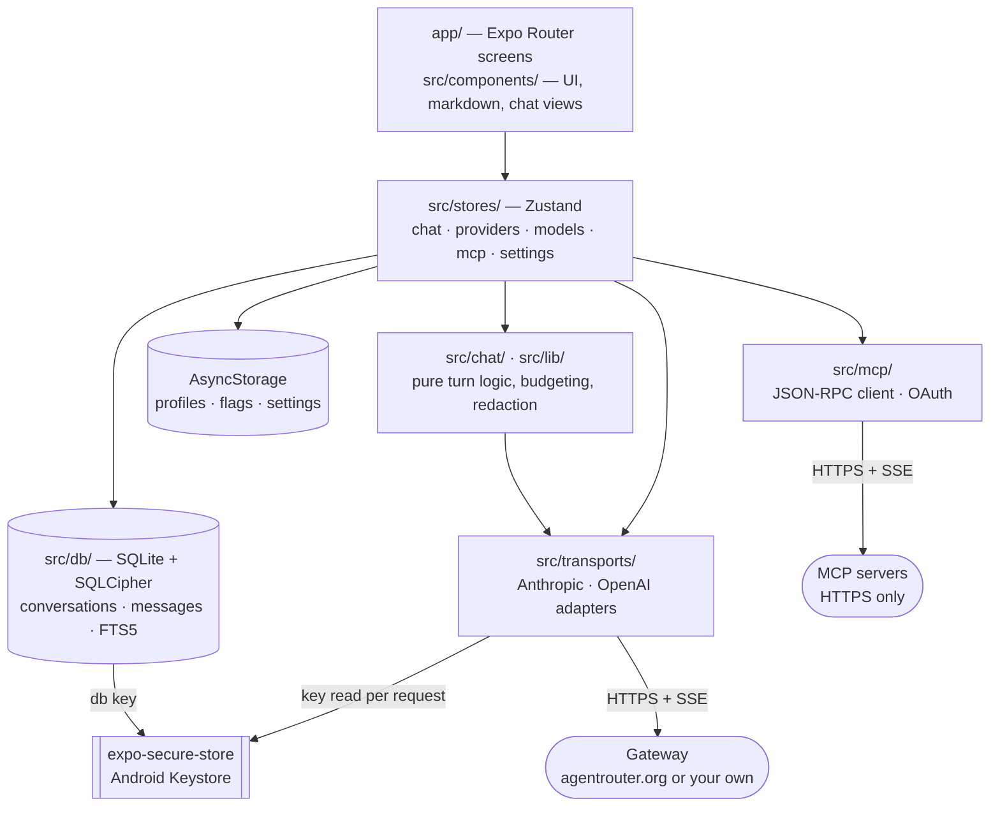
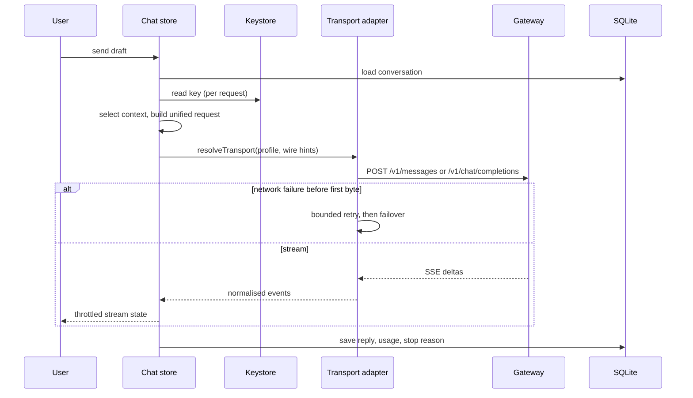
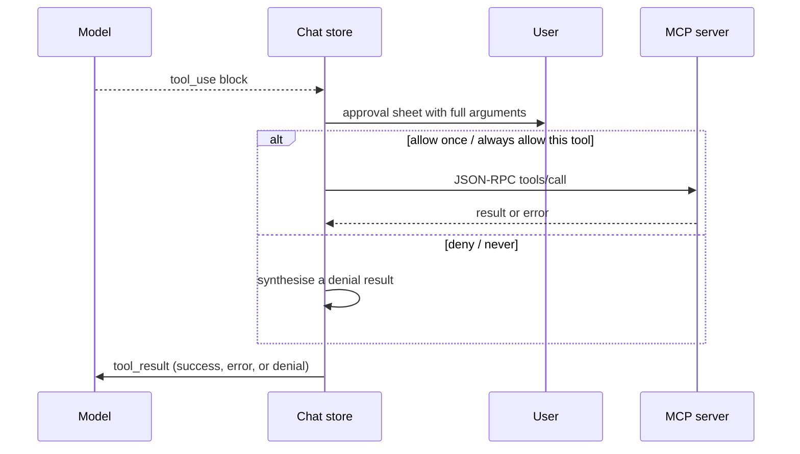
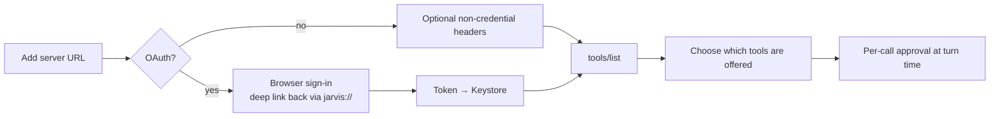

# AgentRouter Mobile

An offline-first Android chat client for [AgentRouter](https://agentrouter.org) and
any other Anthropic- or OpenAI-compatible gateway. Conversations, model settings,
usage data and diagnostics stay on the device. The API key is stored only in the
Android Keystore, and the transcript database is encrypted at rest.

Built with Expo SDK 57 and React Native 0.86. Ships as a direct APK — no Play Store
listing, no OTA channel, no telemetry.

[](https://github.com/Suke2004/SuperAgent/actions/workflows/ci.yml)
[](LICENSE)

> The app's display name on device is **Jarvis** (`app.json` → `expo.name`); the
> repository, package slug and docs use **AgentRouter Mobile**. Same app.

---

## What it does

Point it at a gateway, paste a token, and talk to a model. Everything past that is
about making a phone a serious place to do that:

- The two AgentRouter wire formats are separate adapters behind one streaming
  interface, so message shape, image encoding, streaming events, tool schemas and
  stop reasons are handled per-dialect instead of approximated.
- Conversations are SQLite rows with FTS5 search, not a JSON blob.
- Context pressure is measured, not guessed: per-message exclusion, rolling
  summarisation, and a token budget that does not double-count thinking against the
  output allowance.
- Tools arrive from MCP servers you add yourself, and every call is approved by you
  mid-turn with its full arguments on screen.
- A turn that fails on a dead network is queued and retried when the gateway is
  reachable again, rather than lost.

## Key features

| | |
| --- | --- |
| **Chat** | Streaming replies, abort and retry, partial replies kept and marked when a stream dies |
| **Providers** | Multiple profiles, custom origins, per-profile extra headers, a staged Test-connection flow that reports the gateway's own error text |
| **Models** | Runtime discovery plus hand-editable capability flags, context limits and pricing; hand edits survive later discovery |
| **Reasoning** | Thinking budgets, sampling parameters, stop sequences |
| **Rendering** | Markdown with syntax-highlighted code, tables, LaTeX, and a scheme-allowlist link sanitiser |
| **Attachments** | Camera, photo library, documents |
| **Context** | Pressure indicators, per-message exclusion, rolling summarisation |
| **Skills** | Markdown skills with YAML frontmatter, single-file or `.zip` import/export, per-conversation toggles |
| **MCP** | JSON-RPC over HTTP/SSE, OAuth hand-off, per-tool approval |
| **Memory** | Distilled durable facts, confirmed one at a time, with a per-conversation opt-out |
| **Search** | FTS5 across conversations and messages |
| **Offline** | Reachability tracking and a retry queue |
| **Usage** | Tokens and cost by day and model, from gateway-reported numbers only |
| **Export** | Markdown and JSON, redacted twice, never carrying attachment bytes |
| **Privacy** | Optional app lock behind the device biometric or PIN |
| **A11y** | Screen-reader labels, disabled-state explanations, read aloud |

## Architecture overview

Full detail in [ARCHITECTURE.md](ARCHITECTURE.md). The short version:



Layer rules, which are the load-bearing part:

| Layer | What lives there |
| --- | --- |
| `app/` | Expo Router screens. Deliberately thin — `jest.config.js` matches `*.test.ts` only, so logic in a component is logic no test can reach. |
| `src/components/` | UI primitives, the markdown/highlighting renderer, chat views. |
| `src/chat/` | Pure turn logic: request building and validation, trimming, budgeting, attachments, skills, prompts, export, backup, speech. |
| `src/stores/` | Zustand state persisted to AsyncStorage. Never the key. |
| `src/db/` | SQLite. All DDL is plain SQL in `ddl.ts` with no `expo-sqlite` import, so tests build the real schema under `node:sqlite`. |
| `src/transports/` | Anthropic and OpenAI adapters behind one streaming interface. `fetch` is injected, which is what lets the layer be tested in plain Node. |
| `src/mcp/` | Hand-rolled JSON-RPC client, protocol parsing, OAuth hand-off. |
| `src/lib/` | Token estimation, redaction, secure key access, app lock, logging. |

### Request lifecycle



### Tool execution and approval



Every outcome — success, server error, timeout, denial — returns as a tool *result*,
so a refused call never costs the conversation.

## Screenshots

None are committed yet. `mockups/` holds the HTML design concepts the UI was built
from; open any of them in a browser. Device screenshots will land here when V1 is
published.

## Tech stack

| | |
| --- | --- |
| Runtime | React Native 0.86.3, React 19.2.3, Expo SDK 57 (managed workflow) |
| Navigation | `expo-router` 57 with typed routes |
| State | Zustand 5, persisted to `@react-native-async-storage/async-storage` |
| Database | `expo-sqlite` 57 with SQLCipher, FTS5, WAL |
| Secrets | `expo-secure-store` (Android Keystore), `expo-local-authentication` |
| Lists | `@shopify/flash-list` 2 |
| Markdown | `marked` + `refractor` |
| Other | `fflate` (skill zips), `js-yaml` (frontmatter), `expo-speech`, `react-native-reanimated` 4 |
| Language | TypeScript 6, `strict` + `noUncheckedIndexedAccess` |
| Tests | Jest 29 in the `node` environment; `node:sqlite` for real-schema database tests |
| Lint | ESLint 10 with `eslint-config-expo` (flat config) |
| Build | EAS Build, APK, internal distribution |

## Requirements

| | |
| --- | --- |
| Node | **24 or newer** — the database tests import `node:sqlite`, which needs `--experimental-sqlite` on Node 22 |
| pnpm | 10.29.1 (the version CI pins and the lockfile was written by) |
| Android | A physical device or emulator. The dev client and release APK are Android-only; iOS is not a target. |
| EAS | An [Expo account](https://expo.dev) — only needed to build an APK, not to run the app |
| Java / Android SDK | Only for `pnpm android` or `eas build --local`. A cloud EAS build needs neither. |

## Installation

```bash
git clone https://github.com/Suke2004/SuperAgent.git
cd SuperAgent
pnpm install
```

pnpm only. `pnpm-lock.yaml` is the committed lockfile; `package-lock.json` and
`yarn.lock` are gitignored, and CI installs with `--frozen-lockfile`.

## Environment configuration

**There is no `.env`, and the app reads no environment variables.** That is
deliberate rather than missing: a gateway token in a dotfile is a token in a
plaintext file that gets committed eventually. Keys are pasted into
Settings → Providers at runtime and stored in the Android Keystore via
`expo-secure-store`.

The one credential anywhere near this project lives in GitHub, not on disk:

| Secret | Where | Why |
| --- | --- | --- |
| `EXPO_TOKEN` | GitHub → Settings → Secrets and variables → Actions | Lets `build-apk.yml` submit an EAS build. An Expo account token, not a signing key — the Android keystore stays in EAS. |

No gateway key ever enters CI, because CI has no reason to talk to a gateway. Keep
that true.

## Development setup

```bash
pnpm install
pnpm start          # Metro; press `a` for Android, or scan with the dev client
```

`expo-sqlite` with SQLCipher, `expo-speech`, `expo-local-authentication` and
`expo-secure-store` are native modules. Expo Go cannot load them — use a
**development build**:

```bash
pnpm android                                  # local build + install, needs the Android SDK
# or
eas build --platform android --profile development
```

Install that once, then `pnpm start` connects to it for JS changes. A rebuild is
needed only when native config changes.

## Running the application

| Command | What it does |
| --- | --- |
| `pnpm start` | Metro dev server for the dev client |
| `pnpm android` | Local debug build, installs on the connected device |
| `pnpm web` | `react-native-web` preview. **Development only** — no Keystore, so keys live in a page variable for the session and the app says so on screen. |

First run: Settings → Providers. AgentRouter is the default — pick Anthropic or
OpenAI, paste the token, save. For another gateway choose Custom URL and enter its
origin. The two AgentRouter endpoints are **not** interchangeable:

- Anthropic: `https://agentrouter.org` (**no** `/v1`) → `POST /v1/messages`
- OpenAI: `https://agentrouter.org/v1` → `POST /v1/chat/completions`, `GET /v1/models`

The selected transport normalises `/v1` itself. Day-to-day operation is
[docs/USAGE.md](docs/USAGE.md).

## Building the APK

```bash
pnpm run build:apk          # EAS cloud build, `preview` profile
pnpm run build:apk:local    # same profile, built on this machine
```

Profiles are in `eas.json`: `development` (dev client), `preview` (release candidate
APK), `production`. All three produce an APK with internal distribution — there is no
AAB and no store submission.

Or from GitHub: **Actions → Build APK → Run workflow**, choosing `preview` or
`production`. Pushing a `v*` tag triggers the same workflow at `preview`. Both paths
re-run all the gates first, because a tag can point at a commit that never saw CI.

## Production build and release

Full process, checklists and rollback paths: [docs/07_Deployment.md](docs/07_Deployment.md).
The outline:

1. Everything green locally — `pnpm gates` plus the Android bundle.
2. Bump `expo.version` **and** `expo.android.versionCode` in `app.json`. A
   `versionCode` may never repeat or go backwards.
3. Update [CHANGELOG.md](CHANGELOG.md).
4. Commit, tag `vX.Y.Z`, push the tag — `build-apk.yml` re-runs the gates and submits
   an EAS build.
5. Download the APK from the Expo dashboard, install it on a physical device, and run
   the device protocol in [docs/07_Deployment.md](docs/07_Deployment.md) §7.
6. Attach the APK to a GitHub release.

OTA updates are off (`updates.enabled: false`). A fix reaches a device as a new APK,
which is the whole reason the device pass in step 5 is not optional.

## MCP setup

Settings → **MCP servers** → add by URL.

**`http(s)` only.** A phone cannot spawn the local processes stdio transports need, so
that field does not exist rather than existing and never working. If a server you want
is stdio-only, put it behind an HTTP bridge on a machine you control.



### Adding and configuring a server

1. Paste the server URL. `https` is required; a plaintext origin is refused.
2. Sign in if it uses OAuth. Tokens go into the Keystore beside the API key, so they
   are redacted from logs and exports from the moment they exist. The `state` nonce is
   full-length and matched on the deep-link callback.
3. Pick which of the server's tools are offered to the model. Nothing is offered by
   default.
4. During a turn, each call is approved individually — *allow once*, *always allow this
   tool*, *deny*, *never* — with the full arguments shown. Leaving the screen resolves
   nothing; the question is still there when you come back.

**Credential headers are refused in the server form.** `authorization`,
`proxy-authorization` and `x-api-key` are rejected rather than stored in AsyncStorage,
and because restoring a backup goes through the same validation, a hand-edited backup
gets the same refusal the form does.

### The trust boundary

An MCP server is code you chose to trust, and a tool result is untrusted input that
reaches the model. Two things follow, both worth stating because neither is enforceable
from inside the app:

- A tool you always-allow runs without asking again. `always` is a decision about the
  server, not the call.
- A malicious server can put instructions in a tool result. The app never executes
  model output — no `eval`, no shell, no WebView — but the model reads it. Add servers
  the way you would install a package.

## Security considerations

Reporting: [SECURITY.md](SECURITY.md). Every finding this project has had, fixed or
open, with its reasoning: [docs/flaws.md](docs/flaws.md).

Three storage tiers, one rule each:

| Tier | Holds | Rule |
| --- | --- | --- |
| Android Keystore | API keys, MCP OAuth tokens, the database key | Never leaves. Not in Zustand, AsyncStorage, logs, exports, backups or git. |
| SQLite | Conversations, messages, memories, MCP rows | AES-256 at rest (SQLCipher) under a Keystore key. Not backup-eligible. |
| AsyncStorage | Provider metadata, model flags, settings | Plaintext on disk — nothing secret may enter a `partialize` output. |

- **The key is read per request** and cached in memory only. Both that cache and the
  transports holding it are dropped when the app is backgrounded; the redactor is
  re-primed from the Keystore on the way back.
- **The database is encrypted** — SQLCipher, AES-256, 32-byte CSPRNG key in one
  Keystore slot. An existing plaintext file is converted once on first launch through a
  two-move swap, so a process killed mid-conversion always leaves one intact copy.
  There is **no escrow**: clearing app data destroys the key and the conversations.
- **`Authorization`, `x-api-key` and `User-Agent` are enforced**, not defaulted — a
  profile header colliding with any of them is deleted before the real one is set, in
  both the HTTP client and the MCP client.
- **Android auto-backup is off** (`allowBackup: false` plus `dataExtractionRules`, via
  `plugins/with-no-backup.js`), so the transcript is not eligible for Google Drive or
  `adb backup`.
- **HTTPS only, system CAs only** — `plugins/with-system-ca-only.js` refuses
  user-installed CAs, which is what certificate pinning was wanted for and costs
  nothing when an operator rotates. Cleartext traffic is refused by the platform in a
  release build and permitted only in the debug source set, where Metro needs it.
- **OTA updates disabled.** Nothing here publishes one, so an open channel would be
  remote-code trust bought for nothing.
- **Redaction at the write boundary.** The debug log and both export formats are
  redacted; exports redact twice and a test greps the finished artefact rather than
  asserting a call site. Exports never carry attachment bytes; backups never carry
  keys, tokens, conversations or memories.
- **Optional app lock** behind the device biometric or PIN, off by default. Separate
  from encryption on purpose: the database key is *not* auth-gated, because that would
  deny the offline send queue access while the device is locked.
- **No telemetry, no analytics, no crash reporting, no WebView, no `eval`.**
- **The User-Agent is honest and static** (`AgentRouterMobile/1.0 (Android)`).
  Impersonating another client to get past a gateway allowlist is not done here.
- **`pnpm audit` reports three advisories**, all in build tooling that never ships to
  the device (`image-size` via Metro, `uuid` via `xcode`). Not overridden, and why:
  [docs/flaws.md](docs/flaws.md) §5.

## Project structure

```text
app/                      Expo Router screens
  _layout.tsx             Root layout, app lock, background key eviction
  index.tsx               Conversation list
  chat/[id].tsx           The chat screen
  settings/               Providers, models, MCP, skills, prompts, memory,
                          usage, appearance, backup, debug
src/
  chat/                   Pure turn logic — request, trim, budget, attachments,
                          skills, prompts, export, backup, summary, speech
  components/             UI primitives, chat views, markdown renderer
  db/                     SQLite: ddl, schema/migrations, queries, cipher, FTS
  lib/                    secureKey, redact, appLock, tokens, log, storage
  mcp/                    JSON-RPC client, protocol, OAuth
  stores/                 Zustand: chat, providers, models, mcp, skills,
                          prompts, memory, settings, queue, reachability
  theme/                  Tokens and the theme provider
  transports/             Anthropic + OpenAI adapters, SSE, retry, headers
plugins/                  Config plugins: no-backup, system-CA-only
scripts/gen-icons.mjs     Icon generation
docs/                     PRD, TRD, data model, eng plan, deployment,
                          guidelines, usage, flaws, UX test reports
mockups/                  HTML design concepts the UI was built from
.github/workflows/        ci.yml, build-apk.yml
```

Tests sit next to what they test (`src/chat/budget.test.ts`) or in a
`__tests__/` directory where a module needs fixtures.

## Testing

```bash
pnpm gates            # typecheck + lint + tests with coverage floors
pnpm typecheck
pnpm lint
pnpm test
pnpm test:watch
pnpm test:coverage
```

The fourth gate, which CI also runs and the other three structurally cannot replace:

```bash
pnpm expo export --platform android --output-dir .expo-export
```

A full Metro bundle, output discarded, exit code only. `tsc` resolves types but not
what Metro resolves — a bad `@/` alias, a missing asset or a web-only module passes
typecheck and fails on the device.

**1182 tests in 54 suites, ~34s.** Jest runs in the `node` environment, not
`jest-expo`: transports take an injected `fetch`, and `src/db/ddl.ts` is plain SQL
strings with no `expo-sqlite` import, so the database tests build the real schema under
`node:sqlite` and assert query plans with `EXPLAIN QUERY PLAN`.

`testMatch` is `*.test.ts` — never `.tsx`. Components are untested **by design**, and
the consequence is stated rather than hidden: `app/chat/[id].tsx` is the largest, most
stateful file in the app and has zero unit coverage. Rendering, gestures, navigation and
layout are caught by the device protocol in
[docs/07_Deployment.md](docs/07_Deployment.md) §7 or not at all. The reasoning and the
conditions for revisiting it are in [docs/06_Eng_Plan.md](docs/06_Eng_Plan.md) §7.1.

`coverageThreshold` in `jest.config.js` is a **floor at the measured rate**, not a
target. Raise it when a run comes in comfortably higher; never lower it to make a red
run green.

## Continuous integration

Two workflows, both on `ubuntu-latest` with Node 24 and pnpm 10.29.1:

| Workflow | Trigger | Does |
| --- | --- | --- |
| [`ci.yml`](.github/workflows/ci.yml) | Every push to `main`, every pull request | `pnpm install --frozen-lockfile`, typecheck, lint, tests with coverage, Android bundle, coverage table in the run summary |
| [`build-apk.yml`](.github/workflows/build-apk.yml) | Manual dispatch, or a `v*` tag | Re-runs all gates, then submits an EAS build with `--no-wait` |

One job rather than three: install costs more than all the gates together, so splitting
them to get parallel red X's would triple it for a few seconds of wall clock. In-flight
CI runs are cancelled on force-push; build runs are not, because a cancelled build can
leave a queued EAS job with nothing watching it.

[`dependabot.yml`](.github/dependabot.yml) watches non-Expo dependencies and the Actions
monthly. Expo-owned packages are ignored on purpose — the SDK pins them as a tested set,
so they move together during an SDK upgrade via `npx expo install --fix`, never
individually.

## Troubleshooting

| Symptom | Cause and fix |
| --- | --- |
| `401 unauthorized_client_error` from the gateway | Server-side gating that fires **before** the credential is read — a request with no key at all returns the same body. Not necessarily your key. See [docs/flaws.md](docs/flaws.md) §1 and §1b for how to tell the two apart with a real token. |
| Database tests fail to load with an error about `node:sqlite` | Node 22 or older. Use Node 24. |
| `ERR_PNPM_OUTDATED_LOCKFILE` in CI | `package.json` changed without the lockfile. Run `pnpm install` and commit `pnpm-lock.yaml`. |
| Read aloud or the app lock is missing on a device | Both are native modules. An APK built before they were added needs a rebuild. |
| A reply stops mid-stream when you switch apps | Known and open. Android suspends the socket; a foreground service needs the bare workflow. The partial reply is kept and marked aborted, and the conversation is queued for retry. |
| Metro fails on a `.wasm` file | `metro.config.js` adds `wasm` to `assetExts` for `expo-sqlite`'s browser worker. If you replaced that file, put it back. |
| App crashes on launch after an SDK or native change | No OTA channel means no remote fix. Reinstall the previous APK — see [docs/07_Deployment.md](docs/07_Deployment.md) §10.3. |
| "My provider profile is gone" | AsyncStorage hydration timed out at 3s and defaults rendered. Settings → Debug names which stores gave up. |
| Expo Go cannot open the project | Correct. Native modules require a development build — see [Development setup](#development-setup). |
| A local Gradle build fails in `configureCMake…` with `A restricted method in java.lang.System has been called` | JDK too new. AGP supports 17–21; point `JAVA_HOME` at a JDK 17. |
| A local Gradle build bundles the JS, then dies on `'D:\some' is not recognized as an internal or external command` | The project path contains a space and React Native's bundle task does not quote it. Move the checkout to a path without spaces. |
| `ninja: error: manifest 'build.ninja' still dirty after 100 tries` | Host toolchain problem in vendored C++ targets, seen on Windows — no app code involved. Unresolved locally; EAS Build is unaffected. [docs/flaws.md](docs/flaws.md) §6. |

Anything else: `npx expo-doctor` first, then Settings → Debug for the request log with
the key redacted at the write boundary.

## Contributing

Read [CONTRIBUTING.md](CONTRIBUTING.md) for process, then
[docs/GUIDELINES.md](docs/GUIDELINES.md) before writing code — where code goes, the
storage tiers, the secret boundaries, how to change the database, and §14, the list of
decisions that must not be silently undone.

By participating you agree to the [Code of Conduct](CODE_OF_CONDUCT.md).

## License

[MIT](LICENSE).

## Roadmap

Every planned phase of the original plan is implemented — provider setup, model
capability editing, reasoning controls, markdown rendering, search, streaming chat,
multimodal input, skills, MCP, exports, the usage dashboard and the offline queue.
V1 is a hardening and release milestone, not a feature milestone.

Candidates beyond V1, in rough order of value:

- **Backgrounded streaming** — the worst real-world defect in the app, and the largest
  change: a foreground service means the bare workflow.
- **Live-gateway verification** — prompt caching, document blocks and token-estimator
  accuracy are all unmeasured because the gateway rejects every request before the
  credential is considered.
- **Device screenshots and a demo recording** for this README.
- **Component tests** if a second contributor joins; the purity split is the right
  trade for one maintainer and the wrong one for a team.
- **Key rotation surfacing** — currently delete-and-repaste, because the app cannot
  revoke a token it can only send.

Sprint-level detail: [docs/06_Eng_Plan.md](docs/06_Eng_Plan.md) §2.

## Known limitations

Stated so nobody has to discover them:

- **Streamed replies stop when the app is backgrounded.** Partial text is kept and
  marked aborted; the conversation is queued for retry.
- **Live gateway behaviour is unverified.** `agentrouter.org` currently returns
  `unauthorized_client_error` to every request, authenticated or not.
- **Database encryption is unverified on a release build.** The SQLCipher flag changes
  the native build, and that has not yet run on a device.
- **No key escrow.** Clearing app data destroys the Keystore entry and the encrypted
  database with it. By design.
- **Android only.** No iOS target; `pnpm web` is a development preview with no Keystore.
- **No request concurrency limit.** Two simultaneous streams are two uncapped requests.
  Left undone deliberately — the UI shows one conversation at a time.
- **No Play Store distribution, no OTA.** Every fix is a new APK install.
- **`.expo/types/` is never generated in CI**, so `typedRoutes` enforces nothing there;
  the Android bundle gate catches unresolvable routes instead.
- **Components have no unit coverage** — see [Testing](#testing).
- **Three build-tooling advisories** in `pnpm audit`, none in the runtime graph.

---

Documentation index: [ARCHITECTURE.md](ARCHITECTURE.md) ·
[docs/USAGE.md](docs/USAGE.md) · [docs/GUIDELINES.md](docs/GUIDELINES.md) ·
[docs/PRD.md](docs/PRD.md) · [docs/TRD.md](docs/TRD.md) ·
[docs/05_Data_Model.md](docs/05_Data_Model.md) ·
[docs/06_Eng_Plan.md](docs/06_Eng_Plan.md) ·
[docs/07_Deployment.md](docs/07_Deployment.md) · [docs/flaws.md](docs/flaws.md) ·
[docs/ux-testing/](docs/ux-testing/) · [CHANGELOG.md](CHANGELOG.md)


